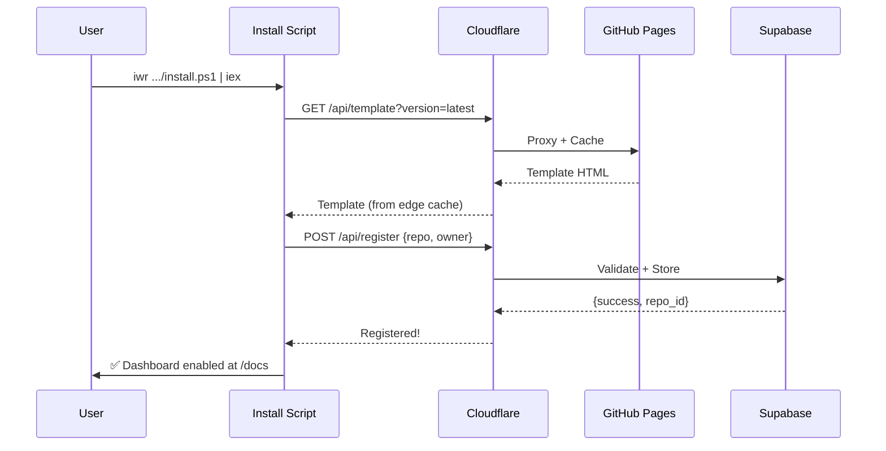

## 📋 Descripción

Configurar `software-factory-site` (repo público) como el **Control Panel** central que:
1. Sirve las plantillas del dashboard para repos instalados
2. Gestiona autenticación y servicios via Supabase
3. Expone APIs públicas protegidas por Cloudflare

## 🏗️ Arquitectura Propuesta

```
┌─────────────────────────────────────────────────────────────────────────────┐
│                          SOFTWARE FACTORY ECOSYSTEM                          │
├─────────────────────────────────────────────────────────────────────────────┤
│                                                                              │
│  ┌──────────────────────────────────────────────────────────────────────┐   │
│  │                    software-factory-site (PUBLIC)                     │   │
│  │                    https://iberi22.github.io/software-factory-site    │   │
│  │                                                                       │   │
│  │  ┌─────────────┐  ┌─────────────┐  ┌────────────┐  ┌──────────────┐  │   │
│  │  │  Landing    │  │    Docs     │  │  Pricing   │  │   Dashboard  │  │   │
│  │  │   Page      │  │   (MDX)     │  │  (Stripe)  │  │   Template   │  │   │
│  │  └─────────────┘  └─────────────┘  └────────────┘  └──────────────┘  │   │
│  │                                                                       │   │
│  │  ┌─────────────────────────────────────────────────────────────────┐ │   │
│  │  │  /api/ → Cloudflare Workers Proxy                               │ │   │
│  │  │    • /api/register    - Registrar nuevo repo                    │ │   │
│  │  │    • /api/template    - Obtener plantilla dashboard             │ │   │
│  │  │    • /api/metrics     - Enviar métricas (rate limited)          │ │   │
│  │  │    • /api/health      - Health check para repos clientes        │ │   │
│  │  └─────────────────────────────────────────────────────────────────┘ │   │
│  └──────────────────────────────────────────────────────────────────────┘   │
│                                      │                                       │
│                                      ▼                                       │
│  ┌──────────────────────────────────────────────────────────────────────┐   │
│  │                     CLOUDFLARE (Protection Layer)                     │   │
│  │                                                                       │   │
│  │  ┌─────────────┐  ┌─────────────┐  ┌────────────────────────────┐   │   │
│  │  │  WAF Rules  │  │ Rate Limit  │  │  Bot Protection (Turnstile) │   │   │
│  │  │  (Free)     │  │ (Free)      │  │  (Free)                     │   │   │
│  │  └─────────────┘  └─────────────┘  └────────────────────────────┘   │   │
│  │                                                                       │   │
│  │  ┌─────────────────────────────────────────────────────────────────┐ │   │
│  │  │  Cloudflare Workers (Edge Functions)                            │ │   │
│  │  │    • factory-api.iberi22.workers.dev                            │ │   │
│  │  │    • Validación JWT + Rate limiting + Caching                   │ │   │
│  │  └─────────────────────────────────────────────────────────────────┘ │   │
│  └──────────────────────────────────────────────────────────────────────┘   │
│                                      │                                       │
│                                      ▼                                       │
│  ┌──────────────────────────────────────────────────────────────────────┐   │
│  │                         SUPABASE (Backend)                            │   │
│  │                                                                       │   │
│  │  ┌─────────────┐  ┌─────────────┐  ┌────────────────────────────┐   │   │
│  │  │    Auth     │  │  Database   │  │      Edge Functions        │   │   │
│  │  │  (GitHub)   │  │ (PostgreSQL)│  │   (jules-orchestrator)     │   │   │
│  │  └─────────────┘  └─────────────┘  └────────────────────────────┘   │   │
│  │                                                                       │   │
│  │  Tables:                                                              │   │
│  │    • users (GitHub OAuth)                                            │   │
│  │    • subscriptions (Stripe integration)                              │   │
│  │    • registered_repos (repos instalados)                             │   │
│  │    • metrics (telemetría de repos)                                   │   │
│  │    • jules_sessions (sesiones AI)                                    │   │
│  └──────────────────────────────────────────────────────────────────────┘   │
│                                                                              │
└─────────────────────────────────────────────────────────────────────────────┘
```

## 🔐 Análisis de Seguridad: ¿Cloudflare es necesario?

### **RECOMENDACIÓN: SÍ, usar Cloudflare (Free Tier)**

| Servicio | Sin Cloudflare | Con Cloudflare (Free) |
|----------|----------------|----------------------|
| **DDoS** | Expuesto | ✅ Protección automática |
| **Rate Limiting** | Manual (Supabase) | ✅ Edge (más eficiente) |
| **Bot Traffic** | Sin filtro | ✅ Turnstile CAPTCHA |
| **SSL/TLS** | GitHub Pages SSL | ✅ Full SSL + Edge certs |
| **Caching** | Sin cache | ✅ CDN global |
| **Analytics** | Limitado | ✅ Web Analytics gratis |
| **WAF Rules** | Ninguna | ✅ 5 reglas gratis |

### **Configuración Recomendada**

```yaml
# cloudflare-config.yaml (conceptual)
zone: software-factory.dev  # Dominio custom opcional

security:
  waf:
    - block_sql_injection: true
    - block_xss: true
    - challenge_suspicious: true

  rate_limiting:
    - path: "/api/*"
      requests_per_minute: 60
      action: challenge

    - path: "/api/register"
      requests_per_minute: 5
      action: block

bot_protection:
  turnstile:
    enabled: true
    pages:
      - "/pricing"
      - "/api/register"

caching:
  rules:
    - path: "/templates/*"
      ttl: 86400  # 1 día
    - path: "/api/health"
      ttl: 60     # 1 minuto
```

## ✅ Tareas de Implementación

### 1. Estructura del Site Público
- [ ] Agregar carpeta `/public/templates/` con dashboard template
- [ ] Crear `/src/pages/api/` endpoints
- [ ] Configurar variables de entorno para Supabase

### 2. Supabase Setup
- [ ] Crear tablas: `registered_repos`, `metrics`, `subscriptions`
- [ ] Configurar GitHub OAuth provider
- [ ] Crear Edge Functions para validación

### 3. Cloudflare Configuration
- [ ] Crear Worker `factory-api` para proxy/rate limiting
- [ ] Configurar WAF rules básicas
- [ ] Setup Turnstile para páginas sensibles
- [ ] Configurar caching de templates

### 4. Template Distribution
- [ ] Endpoint `/api/template?version=latest` para obtener dashboard
- [ ] Versionado de templates (v1, v2, etc.)
- [ ] Fallback a GitHub raw si Cloudflare falla

## 📁 Estructura de Archivos Propuesta

```
software-factory-site/
├── src/
│   ├── pages/
│   │   ├── index.astro           # Landing
│   │   ├── docs/                 # Documentación
│   │   ├── pricing/              # Planes + Stripe
│   │   ├── dashboard/            # Panel de usuario (auth required)
│   │   └── api/                  # API Routes
│   │       ├── register.ts       # POST: registrar repo
│   │       ├── template.ts       # GET: obtener template
│   │       ├── metrics.ts        # POST: recibir telemetría
│   │       └── health.ts         # GET: health check
│   ├── lib/
│   │   ├── supabase.ts           # Cliente Supabase
│   │   ├── cloudflare.ts         # Utils Cloudflare
│   │   └── auth.ts               # Auth helpers
│   └── components/
│       └── Dashboard/            # Componentes dashboard
├── public/
│   └── templates/
│       ├── dashboard/
│       │   ├── v1/
│       │   │   └── index.html
│       │   └── latest -> v1/
│       └── install/
│           ├── install.ps1
│           └── install.sh
└── workers/
    └── factory-api/              # Cloudflare Worker
        ├── src/
        │   └── index.ts
        └── wrangler.toml
```

## 🔗 URLs de Servicio

| Servicio | URL | Protección |
|----------|-----|------------|
| Landing | `https://iberi22.github.io/software-factory-site` | Pública |
| Docs | `https://iberi22.github.io/software-factory-site/docs` | Pública |
| Dashboard | `https://iberi22.github.io/software-factory-site/dashboard` | Auth (GitHub OAuth) |
| API | `https://factory-api.iberi22.workers.dev` | Cloudflare + Rate Limit |
| Templates | `https://iberi22.github.io/software-factory-site/templates/` | Pública (cached) |

## 📊 Flujo de Instalación Actualizado


